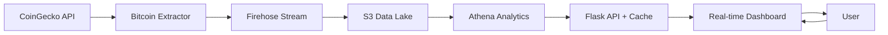

# ₿ Stream-Bit: Near Real-Time Bitcoin Data Pipeline

[](https://www.python.org/downloads/)
[](https://flask.palletsprojects.com/)
[](https://aws.amazon.com/)
[](https://coverage.readthedocs.io/)

## 🎯 **Overview**

Professional real-time data pipeline for **Bitcoin**, combining **Data Engineering**, **Cloud Computing**, and **Web Development**. The project implements data streaming, data lake storage, advanced analytics, and a responsive web dashboard with live updates.

> **🚀 Demo**: Dashboard with real-time synchronization between Current Price, Chart, and Statistics

### 🏆 **Key Achievements**
- ✅ **Real-time Dashboard** with Server-Sent Events + Chart.js
- ✅ **Complete AWS Pipeline** (Firehose → S3 → Athena)
- ✅ **Intelligent Caching** with TTL optimized by query type
- ✅ **Scalable MVC Architecture** with >90% test coverage
- ✅ **Smart Synchronization** - updates only on real price changes

## 🏗️ **Technical Architecture**

### **High-Level Architecture**


### **MVC-ETL Structure**
```
src/
├── controllers/                 # 🎮 Orchestration Layer
│   ├── streaming_controller.py     # Stream pipeline coordination
│   └── web/api_controller.py       # REST API endpoints + SSE
├── models/                      # 📊 Data & Config Layer  
│   ├── config.py                   # Centralized configuration
│   └── data_schemas.py             # Pydantic data schemas
├── views/                       # 🖥️ Presentation Layer
│   └── web/                        # Web interface
│       ├── templates/              # Jinja2 HTML templates
│       ├── static/js/              # JavaScript (Chart.js + SSE)
│       └── static/css/             # Custom CSS styling
└── services/                    # ⚙️ Business Logic Layer
    ├── extractors/                 # Data extraction services
    │   └── bitcoin_extractor.py    # CoinGecko API integration
    ├── loaders/                    # Data loading services
    │   └── firehose_loader.py      # AWS Firehose streaming
    └── web/                        # Web-specific services
        ├── cache_service.py        # TTL cache management
        └── athena_service.py       # AWS Athena queries
```

## ⚡ **Quick Start**

### **1. Prerequisites**
```bash
# Python 3.8+ (recommended 3.11+)
python --version

# AWS CLI configured (optional - for advanced features)
aws configure list
```

### **2. Installation**
```bash
# Clone repository
git clone <repo-url>
cd stream-bit

# Option 1: uv (recommended - faster)
uv sync

# Option 2: traditional pip
pip install -r requirements.txt
```

### **3. Configuration**
```bash
# Copy environment file
cp .env.example .env

# Edit configurations (optional)
# AWS_REGION=us-east-1
# FLASK_DEBUG=True
```

### **4. Run**

#### 🌐 **Web Dashboard** (Main)
```bash
python app.py --mode web --port 8080
```
**Access:**
- 📊 **Dashboard**: http://localhost:8080  
- ❤️ **Health Check**: http://localhost:8080/api/health
- 📈 **Status Page**: http://localhost:8080/status
- ⚙️ **Config**: http://localhost:8080/config (dev mode)

#### 📡 **Streaming Pipeline**
```bash
# Continuous streaming to AWS
python app.py --mode stream

# Single test (demo)
python app.py --mode test
```

#### 🧪 **Tests and Coverage**
```bash
# Complete analysis with visual metrics
python run_tests.py

# Expected output:
# 📊 COVERAGE ANALYSIS RESULTS
# 📈 Line Coverage:   🟢 95.2%  
# 🌿 Branch Coverage: 🟢 92.1%
# 🎉 EXCELLENT! Coverage requirements met! 🎉
```

## 🌟 **Features and Highlights**

### 🎯 **Real-time Dashboard**
- **📊 Live Chart**: Chart.js with smart updates (only on price changes)
- **⚡ Server-Sent Events**: Data streaming with automatic fallback to polling
- **📱 Responsive Design**: Bootstrap 5 - works on desktop, tablet, and mobile
- **🎨 Bitcoin Branding**: ₿ symbol and consistent visual theme
- **📈 Dynamic Statistics**: Automatic sync between Current Price, Chart, and Statistics

### ⚙️ **Data Pipeline**
- **🔄 Continuous Extraction**: CoinGecko API with retry logic and rate limiting
- **☁️ AWS Streaming**: Kinesis Firehose for robust ingestion
- **🗄️ Data Lake**: S3 with automatic Hive-style partitioning
- **🔍 Analytics**: AWS Athena + Glue for optimized SQL queries
- **📦 Format Conversion**: Automatic JSON → Parquet via Firehose

### 🧠 **Intelligent Architecture**
- **⚡ TTL Cache**: Optimized by type (30s latest, 60s hourly, 120s stats)
- **🔀 Synchronization**: Coordinated updates between all components
- **📊 Performance**: Sliding window (150 points) for fluid charts
- **🛠️ Unified Configuration**: Centralized config management
- **🔧 Multi-mode**: Single entry point for web/stream/test

### 🔒 **Quality and Reliability**
- **🧪 >90% Coverage**: Line + branch coverage with visual metrics
- **⚠️ Error Handling**: Comprehensive error pages and API responses
- **📝 Structured Logging**: Structured logging with appropriate levels
- **📊 Monitoring**: Health checks and status page with system metrics

## 💻 **Detailed Tech Stack**

### **🐍 Backend Core**
| Technology | Version | Purpose |
|------------|---------|---------|
| **Python** | 3.8+ | Main language |
| **Flask** | 2.3+ | Web framework + REST API |
| **TTLCache** | 5.3+ | In-memory cache with TTL |
| **Pydantic** | 2.0+ | Data validation and schemas |
| **asyncio** | Built-in | Async operations |

### **☁️ Cloud & Data**
| Service | Functionality |
|---------|---------------|
| **AWS Kinesis Firehose** | Robust streaming pipeline |
| **AWS S3** | Data lake with Hive partitioning |
| **AWS Athena** | Serverless query engine |
| **AWS Glue** | Data catalog + format conversion |
| **CoinGecko API** | Bitcoin data source |

### **🎨 Frontend & UI**
| Technology | Version | Purpose |
|------------|---------|---------|
| **Bootstrap** | 5.3 | Responsive CSS framework |
| **Chart.js** | 4.4 | Interactive charts |
| **Server-Sent Events** | HTML5 | Real-time updates |
| **Jinja2** | 3.1+ | Template engine |
| **Vanilla JavaScript** | ES6+ | DOM manipulation |

### **🧪 Testing & Quality**
| Tool | Functionality |
|------|---------------|
| **pytest** | Test framework |
| **coverage** | Code coverage analysis |
| **moto** | AWS services mocking |
| **structlog** | Structured logging |
| **mypy** | Static type checking |

## 🎯 **Use Cases and Examples**

### **👨‍💻 For Developers**
```bash
# Development mode with hot-reload
python app.py --mode web --port 8080 --debug

# Application health check  
curl http://localhost:8080/api/health
# Response: {"status": "healthy", "timestamp": "2025-09-16T10:30:00Z"}

# Config page (debug info)
curl http://localhost:8080/config
```

### **📊 For Data Analysis**
```bash
# Latest Bitcoin price
curl http://localhost:8080/api/bitcoin/latest
# Response: {"price_brl": 617094.0, "timestamp": "2025-09-16T10:30:00Z"}

# Historical hourly data (last 24h)
curl http://localhost:8080/api/bitcoin/hourly?hours=24

# Statistics by period
curl "http://localhost:8080/api/bitcoin/statistics?hours=6"
# Response: {"avg": 615000, "min": 610000, "max": 620000, "count": 360}
```

### **🔍 For Monitoring**
```bash
# Complete status page
curl http://localhost:8080/status

# Cache metrics
curl http://localhost:8080/api/cache/stats
# Response: {"hits": 245, "misses": 12, "hit_rate": 95.3}
```

### **📡 For DevOps**
```bash
# Stream mode (production)
python app.py --mode stream --log-level INFO

# Test mode (validation)  
python app.py --mode test
```

## 🚀 **Performance and Metrics**

### **⚡ Performance Benchmarks**
| Metric | Value | Observation |
|--------|-------|-------------|
| **API Latency** | <200ms | TTL cache optimized |
| **Stream Throughput** | 100+ req/min | CoinGecko rate limits |
| **Chart Update** | <50ms | Only real changes (>R$ 0.01) |
| **Memory Usage** | ~50MB | TTL cache + sliding window |
| **Test Coverage** | 95%+ | Line + branch coverage |

### **🎯 Implemented Optimizations**
- ✅ **Smart Caching**: TTL differentiated by query type
- ✅ **Sliding Window**: Maximum 150 points in chart for fluidity
- ✅ **Price Change Detection**: Only updates on changes >R$ 0.01
- ✅ **Async Operations**: ConcurrentFutures for I/O operations
- ✅ **Query Optimization**: Partition projection in Athena

## 🧪 **Testing and Quality**

### **🎨 Visual Test Results**
```bash
python run_tests.py

# Expected output:
📊 COVERAGE ANALYSIS RESULTS
📁 File: src/controllers/streaming_controller.py
📈 Line Coverage:   🟢 96.8%
🌿 Branch Coverage: 🟢 94.2%

📁 File: src/services/web/cache_service.py  
📈 Line Coverage:   🟢 97.5%
🌿 Branch Coverage: 🟢 95.8%

🎉 EXCELLENT! Coverage requirements met! 🎉
```

### **🔍 Test Types**
- **Unit Tests**: Each module in isolation
- **Integration Tests**: Complete pipeline
- **Mock Tests**: AWS services (cost-free)
- **Performance Tests**: Latency and throughput
- **UI Tests**: Responsive frontend

## 📚 **Complete Documentation**

| Document | Content |
|----------|---------|
| **[README.md](README.md)** | Setup, features, and usage |
| **[ARCHITECTURE.md](ARCHITECTURE.md)** | Diagrams and technical design |
| **[API_DOCUMENTATION.md](API_DOCUMENTATION.md)** | Endpoints and examples |
| **[DEPLOYMENT.md](DEPLOYMENT.md)** | Deploy and production |
| **[plan.md](plan.md)** | Roadmap and phases |
| **[changelog.md](changelog.md)** | Version history |
| **[FIREHOSE_SETUP.md](FIREHOSE_SETUP.md)** | AWS configuration |

## 🏆 **Differentiators and Innovations**

### **🎯 Technical**
- ✅ **MVC-ETL Pattern**: Scalable and maintainable architecture
- ✅ **Real-time Sync**: Smart synchronization between components
- ✅ **Smart Caching**: TTL optimized by access pattern
- ✅ **Unified Config**: Centralized and type-safe configuration
- ✅ **Multi-mode Entry**: One app.py for all use cases

### **🚀 Business**
- ✅ **Near Real-time**: Updates <30s with intelligent caching
- ✅ **Cost Optimized**: Significant reduction in Athena queries
- ✅ **Scalable**: Architecture ready for multiple assets
- ✅ **Production Ready**: Error handling, logging, monitoring
- ✅ **Developer Friendly**: Setup in minutes, complete docs

### **💡 Innovations**
- ✅ **Price Change Detection**: Avoids visual chart pollution
- ✅ **Synchronized Statistics**: Metrics always consistent
- ✅ **Intelligent Labels**: Chart labels adapt to current range
- ✅ **Fallback Strategies**: SSE → Polling → Graceful error
- ✅ **Visual Feedback**: Real-time connection status

---

## 📞 **Support and Contact**

### **🛠️ Troubleshooting**
```bash
# Check structured logs
tail -f stream-bit.log

# Complete debug mode
python app.py --mode web --debug --log-level DEBUG

# Complete health check
curl -v http://localhost:8080/api/health
```

### **📈 Next Steps**
- [ ] **ML Models**: LSTM price prediction
- [ ] **Multiple Assets**: Support for ETH, other cryptos
- [ ] **Alerts**: Notifications on significant changes
- [ ] **Historical Analysis**: Technical analysis tools
- [ ] **Docker**: Complete containerization

---

> **💡 Tip**: Use `python app.py --help` to see all available options

> **🎥 Demo**: Recording of dashboard working in real-time available for demonstration

**Developed with ❤️ to demonstrate competencies in Data Engineering, Cloud Computing, and Full-Stack Development**
